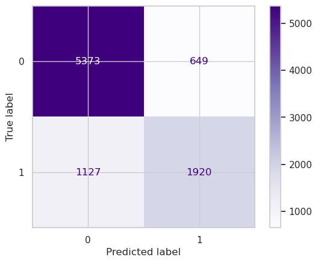
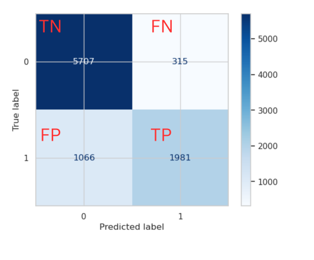

# Hotel Booking Cancellation Prediction

## Overview

This project aims to develop a predictive model to forecast hotel booking cancellations using a Kaggle [dataset](https://www.kaggle.com/datasets/ahsan81/hotel-reservations-classification-dataset) of hotel reservations. The goal is to accurately predict cancellations, helping hotels optimize inventory, staff, and revenue strategies.

The project involves data cleaning, exploratory analysis, feature engineering, model selection, and evaluation using metrics like accuracy, precision, recall, and F1-score. By analyzing the factors contributing to cancellations, the project seeks to provide valuable insights for the hospitality industry, enabling better resource management and improved customer satisfaction.

## Business Understanding

The hospitality industry faces significant challenges with booking cancellations, which can lead to lost revenue and lower occupancy rates. With cancellation rates rising to 40%, there's a clear need for a predictive model to forecast these cancellations accurately. Such a model would allow hotels to proactively address potential cancellations, optimize staff and inventory management, and offer targeted promotions to retain bookings. This project aims to provide hotels with a tool to enhance revenue strategies, increase customer satisfaction, and reduce the financial impact of cancellations, giving them a competitive edge.

## Data Understanding

To build the predictive model, I used the Hotel Reservations [Dataset](https://www.kaggle.com/datasets/ahsan81/hotel-reservations-classification-dataset) from Kaggle, which includes data on customer bookings. Key features include the number of guests, meal plans, parking requirements, room types, lead time, arrival dates, and market segments. The dataset has 36,275 rows and 19 columns, with the target variable being booking_status (1 for canceled, 0 for not). I applied ***OneHotEncoder*** to categorical features and used ***StandardScaler*** for numerical features to prepare the data for modeling.

## Modeling - Baseline Model

I began by creating a Logistic Regression model using scikit-learn's `LogisticRegression` class. The model was trained on the `X_train_transformed` and `y_train` data. This baseline model estimates the probability of booking cancellations (booking_status) based on input features, providing a foundation for comparison. The model's performance metrics are as follows:

- Accuracy of 80.4% - The percentage of correct predictions.
- Precision of 74.74% - The percentage of true positive predictions among all positive predictions.
- ROC AUC score of 0.76 - Reflects the model's ability to distinguish between cancellations and non-cancellations.

These metrics provide a baseline to assess model performance and highlight areas for potential improvement.

Baseline Model:

Decision Tree Model:

## Recommendations

- **Final Model Selection**: I selected the ***Decision Tree Classifier*** with a maximum depth of 7 as the final model for predicting hotel booking cancellations. This model strikes a balance between complexity and performance, achieving a precision score of 86%, significantly higher than the baseline model's 74.74%.
- **Key Factor - Lead Time**: The primary factor influencing cancellations is lead time, which measures the number of days between booking and arrival. Longer lead times correlate with higher cancellation rates, as plans can change over time. Hotel management should consider monitoring lead times closely and potentially adjusting cancellation policies or offering incentives for early confirmations to reduce cancellations.

## For a thorough analysis of this dataset, checkout this [notebook](https://github.com/kev065/hotel-booking-cancellation-prediction/blob/main/index.ipynb)

### Licence

This project is licenced under the [MIT Licence](https://github.com/kev065/hotel-booking-cancellation-prediction/blob/main/LICENSE)